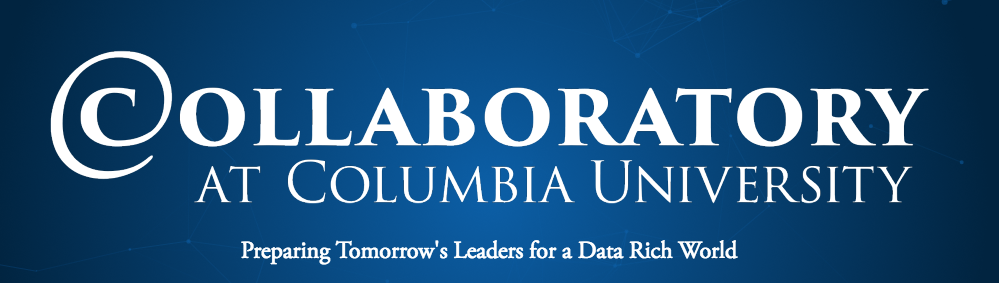

## [Collaboratory@Columbia](http://collaboratory.columbia.edu/)
### Columbia [Data Science Institute](http://datascience.columbia.edu/) and [Columbia Enterpreneuship](http://entrepreneurship.columbia.edu/)
## Winter 2017-2018 Data Science Bootcamp

- When: January 8th – 12th, 2018
- Where: Design Studio, Room 430 of the Riverside Church (490 Riverside Dr, New York, NY 10027)
- Daily schedule: 10am to 4pm (9am to 10am, Introduction January 8th)

### Course Information
The course is a blend of online learning experiences (about 2 hours of preparation will be required per day), in-class lectures, hands-on laboratory exercises with a variety of data sets, and a capstone project. The course will use the Python programming language. Participants are required to bring their own computer to the daily sessions. Lunch and refreshments are **NOT** provided.

### Schedule (tentative)
#### Typical daily schedule (unless otherwise noted)
- 10:00am-12:00pm: Session 1 (1h introduction + 1h lab)
- 12:00pm-1:00pm: Lunch Break
- 1:00pm-2:30pm: Session 2 (30 min introduction + 1h lab)
- 2:30pm-3:00pm: Break
- 3:00pm-4:00pm: Session 3 (1h lab)

(Pre-assignments are short videos that should be studied before coming to the sessions.)

#### Day 1: January 8th, 2018: INTRODUCTION TO DATA SCIENCE [[slide deck]](https://github.com/DS-BootCamp-Collaboratory-Columbia/AY2017-2018-Winter/tree/master/Bootcamp-materials/slides/Day1) [[notebooks]](https://github.com/DS-BootCamp-Collaboratory-Columbia/AY2017-2018-Winter/tree/master/Bootcamp-materials/notebooks/Day1)[[zip for download]](https://github.com/DS-BootCamp-Collaboratory-Columbia/AY2017-2018-Winter/blob/master/Bootcamp-materials/notebooks/Day1.zip)
- **Topics**: Introduction to Data Science; Data Visualization; Statistical Inference and Modeling.
- **Mandatory pre-assignment** [EdX DS101X Week 4, 4.7-4.11](https://courses.edx.org/courses/course-v1:ColumbiaX+DS101X+1T2017/course/)
- 9:00am-10:00am: Welcome and Registration. 
- 10:00am Lecture: Statistical thinking for data science
- 11:00am Lab session: Getting started with [Python notebooks](https://jupyter.readthedocs.io/en/latest/content-quickstart.html). [Check Environment IPython Notebook](./notebooks/Pre-assignment/check_env.ipynb) & Doing statistics using Python.
- 12:00pm Lunch Break
- 1:00pm Lecture: Introduction to Exploratory Data Analysis and Visualization
- 1:30pm Lab session: [EDAV tutorial - part (1)](https://github.com/DS-BootCamp-Collaboratory-Columbia/AY2017-2018-Winter/blob/master/Bootcamp-materials/notebooks/Day1/doc/tutorial_day1-part1.ipynb)
- 2:30pm Break
- 3:00pm Lab session: [EDAV tutorial - part (2)](https://github.com/DS-BootCamp-Collaboratory-Columbia/AY2017-2018-Winter/blob/master/Bootcamp-materials/notebooks/Day1/doc/tutorial_day1_part2.ipynb)
- [Further reading](https://github.com/DS-BootCamp-Collaboratory-Columbia/AY2017-2018-Winter/blob/master/Bootcamp-materials/FurtherReadings.md)
 
#### Day 2: January 9th, 2018: INTRODUCTION TO MACHINE LEARNING [[notebooks]](https://github.com/DS-BootCamp-Collaboratory-Columbia/AY2017-2018-Winter/tree/master/Bootcamp-materials/notebooks/Day2) [[zip for download]](https://github.com/DS-BootCamp-Collaboratory-Columbia/AY2017-2018-Winter/blob/master/Bootcamp-materials/notebooks/Day2.zip)
- **Topics**: Introduction to Machine Learning; Supervised Learning Algorithms
- **Mandatory pre-assignment** [EdX DS102X Week 4, 4.2-4.5](https://courses.edx.org/courses/course-v1:ColumbiaX+DS102X+1T2017)
- 10:00am Lecture: Introduction to Machine Learning [slides](https://github.com/DS-BootCamp-Collaboratory-Columbia/AY2017-2018-Winter/blob/master/Bootcamp-materials/slides/day2-introduction-to-machine-learning.odp)
- 11:00am Lab session: [Classification and Regression](https://github.com/DS-BootCamp-Collaboratory-Columbia/AY2017-2018-Winter/blob/master/Bootcamp-materials/notebooks/Day2/day2-lab1-classification-and-regression.ipynb)
- 12:00pm Lunch Break
-  1:00pm Lecture: Nearest Neighbors and Linear Models [[slides]](https://github.com/DS-BootCamp-Collaboratory-Columbia/AY2017-2018-Winter/blob/master/Bootcamp-materials/slides/day2-linear-models-nearest-neighbors.odp)
-  1:30pm Lab session: [Nearest Neighbors classification](https://github.com/DS-BootCamp-Collaboratory-Columbia/AY2017-2018-Winter/blob/master/Bootcamp-materials/notebooks/Day2/day2-lab2-nearest-neighbors.ipynb)
-  2:30pm Break
-  3:00pm Lab session: [Linear Models in practice](https://github.com/DS-BootCamp-Collaboratory-Columbia/AY2017-2018-Winter/blob/master/Bootcamp-materials/notebooks/Day2/day2-lab3-linear-models-in-practice.ipynb)

 
#### Day 3: January 10th, 2018: MACHINE LEARNING CONTINUED
- **Topics**: Model Selection; Evaluation; Probabilistic Modelling
- **Mandatory pre-assignment** [EdX DS102X 4.7-4.9, 5.1-5.3](https://courses.edx.org/courses/course-v1:ColumbiaX+DS102X+1T2017)
- 10:00am Continuation of Lab session on linear models and preprocessing, review of lab session.
- 11:00am Lecture: Model Evaluation and Model Selection [[slides]](https://github.com/DS-BootCamp-Collaboratory-Columbia/AY2017-2018-Winter/blob/master/Bootcamp-materials/slides/day3-model-evaluation.odp)
- 12:00pm Lunch Break
-  1:00pm Lab session: Grid Search, cross-validation and metrics
-  1:30pm Lecture: Trees and Forests [[slides]](https://github.com/DS-BootCamp-Collaboratory-Columbia/AY2017-2018-Winter/blob/master/Bootcamp-materials/slides/day3-trees-and-forests.odp)
-  2:30pm Break
-  3:00pm Lab session: Working with tree-based models
 
#### Day 4: January 11th, 2018: ADVANCED TOPICS IN DATA SCIENCE
- **Topics**: Natural Language Processing; Neural Networks.
- **Mandatory pre-assignment** [EdX DS102X 5.4-5.5](https://courses.edx.org/courses/course-v1:ColumbiaX+DS102X+1T2017) [EdX DS103X 4.1-4.5](https://courses.edx.org/courses/course-v1:ColumbiaX+DS103x+1T2017)
- 10:00am Lecture: Neural Networks [[slides]](https://github.com/DS-BootCamp-Collaboratory-Columbia/AY2017-2018-Winter/blob/master/Bootcamp-materials/slides/day4-neural-networks.odp)
- 11:00am Lab session: Building neural networks
- 12:00pm Lunch Break
-  1:00pm Lecture: Natural Language Processing [[slides]](https://github.com/DS-BootCamp-Collaboratory-Columbia/AY2017-2018-Winter/blob/master/Bootcamp-materials/slides/day4-text-data.odp)
-  1:30pm Lab session: Bag of words models
-  2:30pm Break
-  3:00pm Lab session: Text classification and topic models

#### Day 5: January 12th, 2018: CAPSTONE PROJECT
+ **Topics**: Lab project work. 
 

### Prerequisites
 
+ Basics of linear algebra
+ Basics of statistics (mean, variance, etc.)
+ Basic programming skills in Python
+ Basic understanding of data structures and algorithms
+ Basic skills for working with data files (i/o operations on csv and tsv files, etc.)

### Getting started

#### Introductional Material

To get started here are some online resources for programming skills in Python and for setting up the required Python development environment.

+ [Jupyter notebook quickstart](https://jupyter.readthedocs.io/en/latest/content-quickstart.html) A guide on running Jupyter notebooks
+ [Jupyter with Python](http://opentechschool.github.io/python-data-intro/core/notebook.html) Working with Python kernels in Jupyter.
+ [Python Data Science handbook](https://github.com/jakevdp/PythonDataScienceHandbook) A free book in the form of Jupyter notebooks that introduced the core Python data science libraries ([launch interactive session](https://mybinder.org/v2/gh/jakevdp/PythonDataScienceHandbook/master?filepath=notebooks%2FIndex.ipynb))
+ [A whirlwind Tour of Python](https://github.com/jakevdp/WhirlwindTourOfPython) A free book introducing basic Python programming concepts

#### Installation Instructions
+ We’ll be using the [Anaconda Python distribution](https://www.anaconda.com/download/?lang=en-us#linuxQ)
+ Download and install the distribution from the link above
+ Start the Jupyter Notebook and open the [Check Environment IPython Notebook](./notebooks/Pre-assignment/check_env.ipynb). (see [Jupyter notebook quickstart](https://jupyter.readthedocs.io/en/latest/content-quickstart.html))
+ Run the file and make sure no errors are raised.
